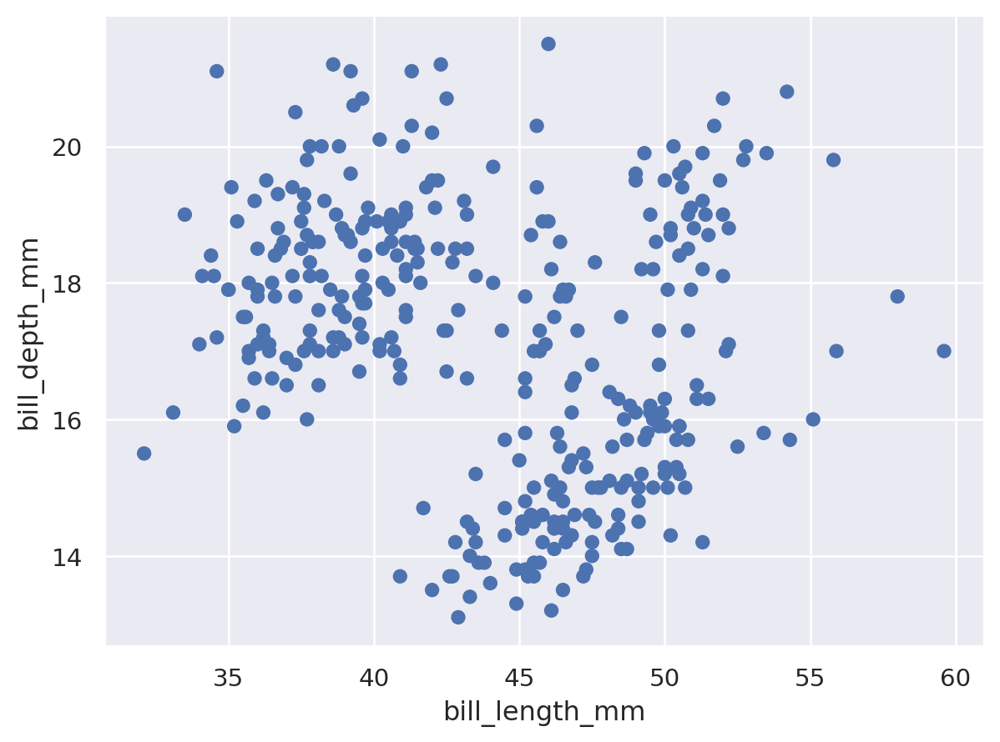

# HW 1 - CS 625, Spring 2025

Ray Saleh
Due: January 26, 2025

## Git, GitHub

*What is the URL of the GitHub repo that you created in your personal account?*
https://github.com/odu-cs625-datavis/Spring25-asv-Ray-Saleh
   
*What is pull vs clone in GitHub?*
in GitHub, Clone is used to make a local copy of a repository from a remote server.
in Github, Pull is used to fetch and merge changes from a remote repository into a local machine
   
*You have committed a change on your local machine/remote. However, you want to undo the changes committed. How would you do that?*

To undo a change commited you can do the following if:
on a local machine:

               git reset --hard head~1

or

               git reset --soft head~1

Remote machine: 
               
                git reset --hard head~1

                git push --force
                
or:              
      
                git revert <commit-hash>

                git push

## Markdown

*Create a bulleted list with at least 3 items*
- Item 1
- Item 2
- Item 3

*Write a single paragraph that demonstrates the use of italics, bold, bold italics, code, and includes a link. The paragraph must explain your favorite Olympic sport/game, the country that won the most number of olympic GOLD medals (Summer) in your favorite sport in 2020 (Japan) and 2024 (France). You are free to include more information.*

*My favorite Olympic sport is **basketball**, where athletes showcase incredible skill and teamwork. In the **2020 Tokyo Olympics**, the country that won the most gold medals in basketball was the United States, with both their men's and women's teams taking home gold. Looking ahead to the **2024 Paris Olympics**, I am excited to see how the host nation, *France*, will perform, though it’s unlikely they will surpass the United States in gold medals. The competition is fierce, and the games always bring excitement to fans worldwide. For more details on Olympic basketball, check out the [official Olympic basketball page](https://olympics.com/en/sports/basketball).*

*Create a level 3 heading*

### This is my level 3 Heading

*Insert a image of your favorite Olympics sport/game, sized appropriately*

## Tableau

*Insert the image of your horizontal bar chart here. Reminder, this should show countries that won the least number of medals only (excluding ZERO) in Paris2024 Summer Olynpics by continent (one country from each continent is ok).*

## Google Colab

*What is the URL of your Google Colab notebook?*

https://colab.research.google.com/drive/1ADhRwLS-KrOg1UcV4iO9YSK8Ixmq3iPa?usp=sharing

## Python/Seaborn

*Insert the first penguin chart here*

*Describe what the figure is showing.*

The relationship between bill length and bill depth in penguins.

*Insert the second penguin chart here*

*Describe what the figure is showing.*

The chart compares the body mass of male and female penguins across three species (Adelie, Gentoo, and Chinstrap).

*What happened when you removed the outer parentheses from the code? Why?*

Removing the outer parentheses from code in Google Colab can cause errors if they are essential for function calls or tuples

## Observable and Vega-Lite

*What happens when you replace `markCircle()` with `markSquare()`?*

It changes the points on the Graph from circles to squares.

*What happens when you replace `markCircle()` with `markPoint()`?*

It changes the circles to hollow circles.

*What change do you need to make to swap the x and y axes on the scatterplot?*

Swap

 vl.x().fieldQ("Horsepower"),       // For x, use the Horsepower field

 vl.y().fieldQ("Miles_per_Gallon"), // For y, use the Miles_per_Gallon field

to

 vl.y().fieldQ("Horsepower"),       // For y, use the Horsepower field

 vl.x().fieldQ("Miles_per_Gallon"), // For x, use the Miles_per_Gallon field

*Insert the bar chart image here*

*Why do you think this chart is the result of this code change?*

In Chart Image 1, We did not run the code which makes the figure remain the same. In Chart Image 2, if we run the code the chart is result of the changed code because we removed the Y axis (vl.y().fieldN("Origin"))

## References

*Every report must list the references (including the URL) that you consulted while completing the assignment. Replace the items below with the references you consulted*

* Reference 1, <https://www.example.com>
* Reference 2, <https://www.example.com/reallyreallyreally-extra-long-URI/>
