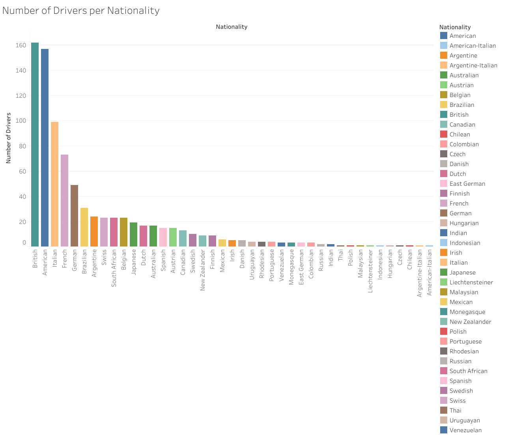
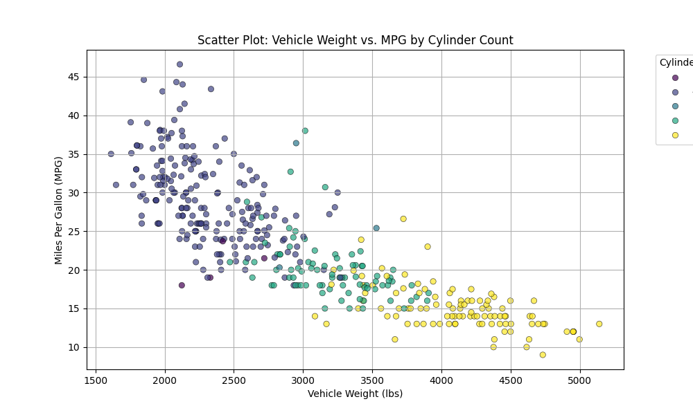
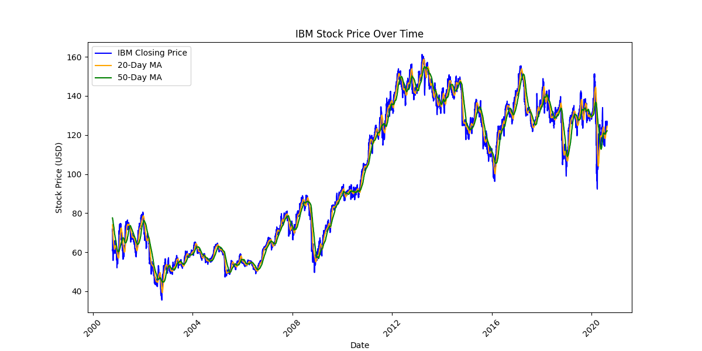

# Homework 3: Create Visualization Idioms from Real-World Data

**Name:** Ray Saleh  
**Class:** CS625-HW3  
**Due Date:** February 23, 2025  

## Part 1. Data Selection and Preparation

### 1. Dataset Selection

- **Chosen Dataset(s):**  
  - *Dataset 1:* `F1 Drivers Dataset` (for Bar Chart)
  - *Dataset 2:* `IBM Stock Dataset` (for Line Chart)
  - *Dataset 3:* `Auto MPG Dataset` (for Scatter Plot)

- **Justification for Dataset Selection:**  
  - Each dataset contains **at least 4 columns and 500 rows**, making them suitable for visualization.
  - Different datasets were used for different visualization idioms.
  - The data was preprocessed where necessary to ensure clarity in visualization.

### 2. Data Preprocessing

- **Cleaning and Transformation Steps:**
  - **F1 Driver Dataset:** Filtered and counted drivers per nationality.
  - **IBM Stock Dataset:** Converted `Date` column to datetime, sorted by date, and extracted relevant stock indicators.
  - **Auto MPG Dataset:** Converted `horsepower` column to numeric, dropped missing values, and extracted relevant features.

---

## Part 2. Visualization Idioms & Encoding Choices

### 1. **Bar Chart (Drivers per Nationality)**
- **Visualization Tools:** `Tableau`
- **Purpose:** Show the number of drivers per nationality.
- **Idiom/Mark/Data/Encode Table:**

  **Idiom:** Bar Chart  
  | Data Attribute | Data Type | Encode (Channel) |
  | --- | --- | --- |
  | `Nationality` | Categorical | X-axis |
  | `Count of Drivers` | Quantitative | Y-axis |

- **Chart Images & Links:**  
  -  
  - [Download Tableau Workbook (`.twbx`)](./Tableau_Workbook.twbx)  

---

### 2. **Scatter Plot (Vehicle Weight vs. MPG)**
- **Visualization Tool:** `Python (Seaborn & Matplotlib)`
- **Purpose:** Show the relationship between vehicle weight and fuel efficiency, with color encoding for cylinder count.
- **Idiom/Mark/Data/Encode Table:**

  **Idiom:** Scatter Plot  
  | Data Attribute | Data Type | Encode (Channel) |
  | --- | --- | --- |
  | `weight` | Numerical | X-axis |
  | `mpg` | Numerical | Y-axis |
  | `cylinders` | Categorical | Color Encoding |

- **Chart Image & Link:**  
  -   
  - [Download Script](./chartScatter.py.py)

---

### 3. **Multiple Line Chart (IBM Stock Price Trends)**
- **Visualization Tool:** `Python (Seaborn & Matplotlib)`
- **Purpose:** Show IBM stock price trends over time with moving averages.
- **Idiom/Mark/Data/Encode Table:**

  **Idiom:** Multiple Line Chart  
  | Data Attribute | Data Type | Encode (Channel) |
  | --- | --- | --- |
  | `Date` | Time-based | X-axis |
  | `Close(t)` | Numerical | Y-axis |
  | `MA20, MA50` | Numerical | Line Encoding |

- **Chart Image & Link:**  
  -   
  - [Download Script](./chartLine.py)

---

## Part 3. Recreation of a Chart in Tableau

- **Recreated Chart:** Bar Chart (Drivers per Nationality)
- **Tool Used:** `Tableau`
- **Steps Taken in Tableau:**
  1. **Loaded the Dataset:** Imported `F1 Drivers Dataset` (`drivers.csv`) into Tableau.
  2. **Created a Bar Chart:**
     - Dragged `Nationality` to the **Columns shelf** (X-axis).
     - Dragged `DriverId` to the **Rows shelf** and set it to **COUNTD(DriverId)** to count unique drivers per nationality.
     - Selected **Bar Chart** under the **Marks** pane.
  3. **Customization & Formatting:**
     - Sorted bars in descending order.
     - Added meaningful axis labels and chart title.
     - Changed colors for better visualization.
  4. **Exporting and Saving:**
     - Saved the **Tableau workbook (`.twbx`)**.
     - Exported the final chart as an **image (`.png`)**.

- **Comparison of Python vs. Tableau:**
  - **Ease of Use:** Tableau is more intuitive with its drag-and-drop interface.
  - **Customization Options:** Python allows more fine-tuned styling and automation.
  - **Final Thoughts:** Python is better for coding-based workflows, while Tableau is excellent for business insights and quick visualization.

---

## Part 4. Reflection

- **Key Takeaways from This Assignment:**
  - Learned how to map data to different visualization idioms.
  - Practiced preprocessing real-world datasets before visualization.
  - Discovered the strengths and weaknesses of different visualization tools.

---

## References

- [Seaborn Documentation](https://seaborn.pydata.org/)
- [Matplotlib Documentation](https://matplotlib.org/)
- [Auto MPG Dataset](https://archive.ics.uci.edu/ml/datasets/auto+mpg)
- [F1 Drivers Dataset](https://github.com/MainakRepositor/Datasets/blob/master/F1/drivers.csv)
- [IBM Stock Dataset](https://github.com/MainakRepositor/Datasets/blob/master/Stocks/IBM.csv)
- [Tableau Public](https://public.tableau.com/app/profile/rayyan.saleh/viz/F1forclass/Sheet1)
