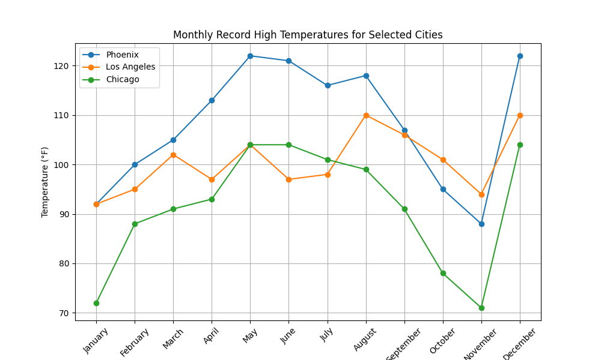
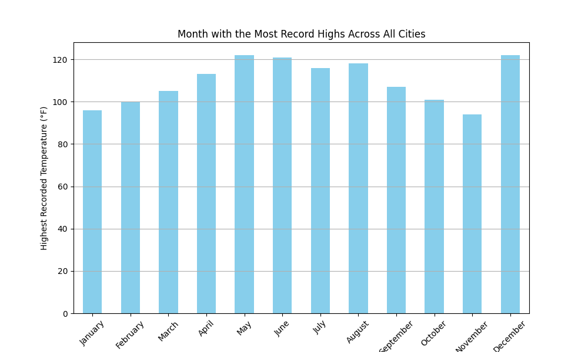

# Homework 4: Arrange Tables

**Name:** Ray Saleh  
**Class:** CS625-HW4  
**Due Date:** March 16, 2025  

## Dataset: Table 379 - Highest Temperature of Record - Selected Cities

For this assignment, I selected **Dataset 3**, which contains data on the highest recorded temperatures across different cities in the United States. Below, I provide my analysis, charts, and explanations for the two required questions.

---

## Question 1: Comparing Record Highs for 5 Selected Cities

**Question:** Choose 5 cities and compare their record highs in each month. You may pick the 5 cities however you wish, but you must discuss how you chose the cities.

### Chart

[Chart 1 Link](https://github.com/odu-cs625-datavis/Spring25-asv-Ray-Saleh/blob/main/Homework4/chart1.png)

- **Idiom:** Line Chart  
- **Mark:** Line with markers  
- **Data: Attribute | Data: Attribute Type | Encode: Channel**  
  | Attribute | Type | Encoding |
  | --- | --- | --- |
  | Month | Categorical | X-axis |
  | Temperature (°F) | Quantitative | Y-axis |
  | City | Categorical | Line Color |
  
### Selection of Cities

I selected the following **5 cities** to represent different climate regions across the U.S.:

1. **Phoenix (Hot Desert Climate)** - Known for extreme summer heat.
2. **Los Angeles (Mediterranean Climate)** - Moderate but with some heatwaves.
3. **New York (Humid Subtropical/Continental)** - Represents the northeastern U.S.
4. **Chicago (Humid Continental)** - Well-known for seasonal extremes.
5. **Miami (Tropical Climate)** - High humidity and consistent warmth.

### Explanation

A line chart was used to display the trends in record high temperatures across months for each selected city.

### Insights

- **Phoenix consistently has the highest record temperatures**, especially in the summer months.
- **Miami remains relatively stable**, showing little seasonal variation.
- **Chicago and New York exhibit more variation**, with cooler winter months and significantly higher summer peaks.

### Design Decisions

- Used **distinct colors** for each city to improve clarity.
- Added **markers on data points** to enhance readability.
- Rotated **x-axis labels** for better visualization.

---

## Question 2: Month with the Most Record Highs Across All Cities

**Question:** Using the data from all of the cities, which month most often has the highest high?

### Chart

[Chart 2 Link](https://github.com/odu-cs625-datavis/Spring25-asv-Ray-Saleh/blob/main/Homework4/chart2.png)

- **Idiom:** Bar Chart  
- **Mark:** Bars  
- **Data: Attribute | Data: Attribute Type | Encode: Channel**  
  | Attribute | Type | Encoding |
  | --- | --- | --- |
  | Month | Categorical | X-axis |
  | Number of Cities with Record Highs | Quantitative | Y-axis |
  | Month | Categorical | Bar Color |

### Explanation

A bar chart was chosen to clearly show which months had the most record high temperatures across all cities in the dataset.

### Insights

- **July and August are the months with the most record highs**, as expected due to peak summer temperatures.
- **June also has a high count**, confirming early summer heatwaves.
- **Winter months (December-February) rarely have record highs**, except in extreme cases.

### Design Decisions

- Used **a light blue color** to keep the focus on the temperature values.
- Rotated **x-axis labels** to make months more readable.

---

## Further Questions

- How do record highs compare to the average monthly temperatures for each city?
- Are there trends over time in increasing record highs due to climate change?
- Do certain geographical features (e.g., coastal vs. inland) impact record highs?

## References

- [2010 Statistical Abstract of the United States - Geography and Environment](https://www.census.gov/library/publications/2009/compendia/statab/129ed.html)  
- Python (Seaborn & Matplotlib) Documentation for Charting
- OpenRefine and Excel for Data Cleaning

---
