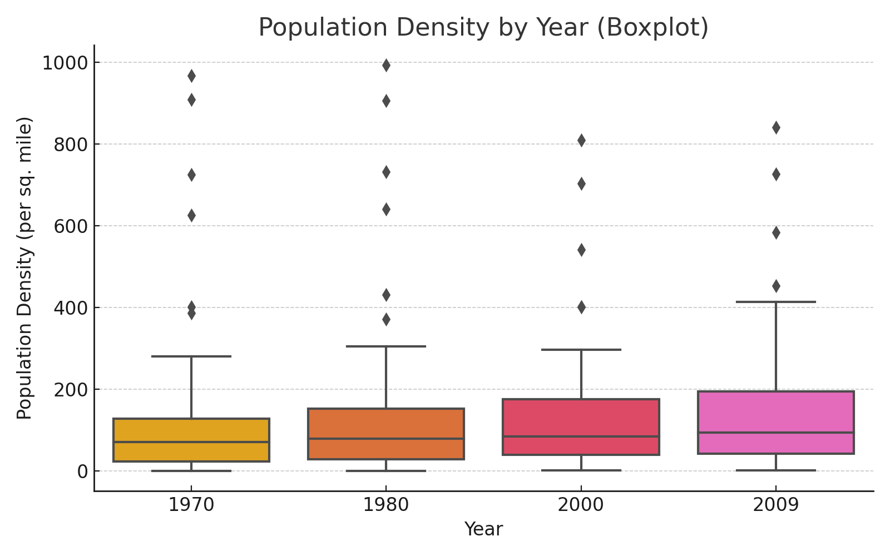
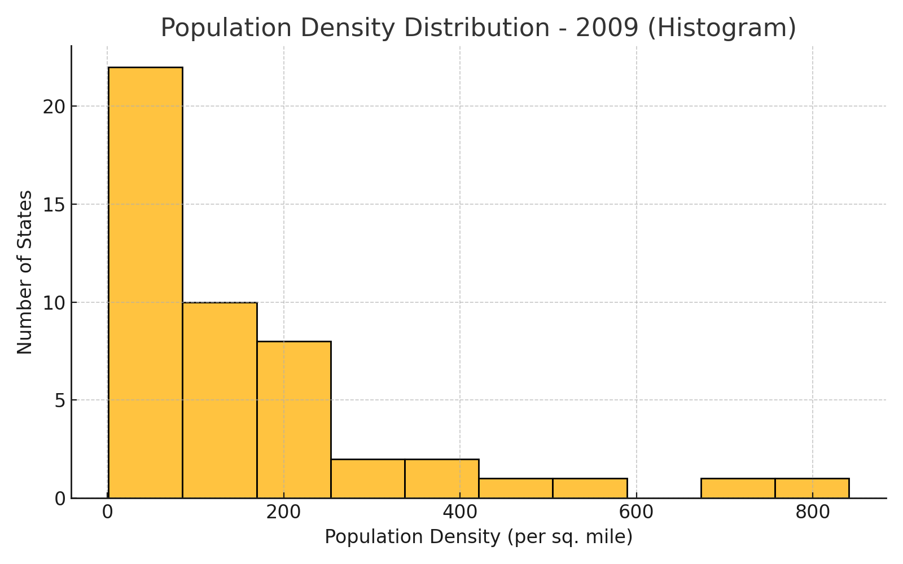
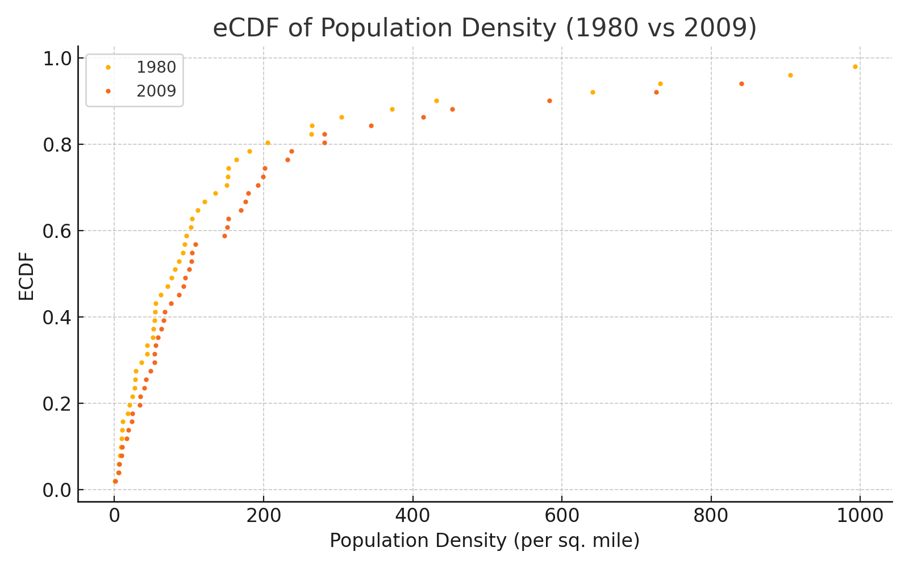
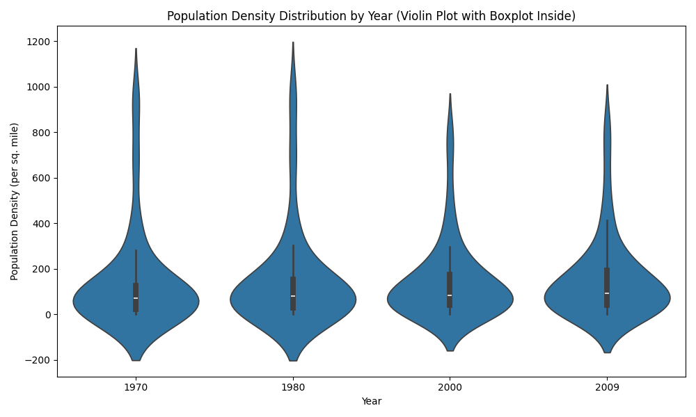

# Homework 5: Analyzing Data Using Distribution Charts

**Name:** Ray Saleh  
**Class:** CS625-HW5  
**Due Date:** March 23, 2025  

---

## Dataset

**Dataset Chosen:** Table 13 - State Population--Rank, Percent Change, And Population Density  
**Source:** [2011 Statistical Abstract of the United States - Section 1. Population](https://www.census.gov/library/publications/2010/compendia/statab/130ed/population.html)  
**PDF Table:** Page 19  
**Reason for Selection:** This dataset provides an insightful view of how state population density has evolved over time, making it useful for identifying trends in population growth and urbanization.

---

## Part 1: Distribution Charts

### Data Preparation

- Removed non-state entities (e.g., District of Columbia)
- Verified population densities are numeric and adjusted for thousands if needed
- Used `pandas.melt()` to convert wide-format table into long-format
- Parsed population density columns for years: **1970, 1980, 2000, 2009**
- Loaded CSV with `read_csv(thousands=',')` to handle formatting

---

### Boxplot: Population Density of All States (1970, 1980, 2000, 2009)

[Boxplot GitHub Link](https://github.com/odu-cs625-datavis/Spring25-asv-Ray-Saleh/blob/main/Homework5/boxplot.png)

**Explanation:**
- Used Seaborn’s `sns.boxplot()` to compare population density across 4 years
- X-axis = year, Y-axis = population density

**Chart Advantages/Disadvantages:**
- Advantage: Shows spread, outliers, and median
- Disadvantage: Doesn’t show exact frequency or cumulative information

**Observations:**
- Population density has increased across all years
- Outliers like New Jersey stand out in each distribution

---

### Histogram: Population Density in 2009

[Histogram GitHub Link](https://github.com/odu-cs625-datavis/spring25-aveerasa-ray-saleh/blob/main/Homework5/histogram.png)

**Explanation:**
- Used `sns.histplot()` with 10 bins
- Focused on distribution in 2009

**Chart Advantages/Disadvantages:**
- Advantage: Shows how density is distributed across states
- Disadvantage: Can hide data detail depending on bin size

**Observations:**
- Most states have lower population densities (< 200 ppl/sq mi)
- A few states significantly skew the distribution

---

### eCDF: Population Density in 1980 and 2009

[eCDF GitHub Link](https://github.com/odu-cs625-datavis/spring25-aveerasa-ray-saleh/blob/main/Homework5/ecdf.png)

**Explanation:**
- Created eCDF plot using a custom function or `plotly.express`
- Overlaid 1980 and 2009 distributions to compare

**Chart Advantages/Disadvantages:**
- Advantage: Displays percentile distribution clearly
- Disadvantage: May be harder to interpret for general audience

**Observations:**
- Clear shift in the curve indicates increased density in many states
- Percentile thresholds (e.g., 50th percentile) increased between 1980 and 2009

---

## Part 2: Further Analysis

### Findings

#### Additional Chart: Violin Plot

To gain a more detailed view of how the **shape of population density distribution** has evolved over time, I created a **violin plot**. Unlike boxplots, violin plots visualize the full distribution by showing the **density of values** at different ranges, while still embedding the median and quartiles via an internal boxplot.

[Violin Plot GitHub Link](https://github.com/odu-cs625-datavis/spring25-aveerasa-ray-saleh/blob/main/Homework5/violin_density_distribution.png)

**Explanation:**
- Created using Seaborn’s `sns.violinplot()` with `inner='box'` to include quartile indicators.
- The wider the plot at a given Y-value, the more states had population densities around that level.
- Data used includes all 50 U.S. states from 1970, 1980, 2000, and 2009.

**Insight:**
- Population density is clearly **right-skewed**, especially in 2000 and 2009.
- The **spread of densities has increased over time**, showing a growing disparity between low- and high-density states.
- Compared to a histogram or boxplot alone, the violin plot helps convey how certain density ranges became more (or less) common over time.

**Finding 1:**
States with lower initial density saw the largest percent increases.
Discovered by reviewing eCDF chart showing percentile shifts and histogram highlighting clustered low-density values.

**Finding 2:**
Northeastern states consistently remain outliers in density.
Boxplot outliers and line chart for regional averages confirmed this.

**Finding 3:**
There’s a widening gap between low-density and high-density states over time.
The boxplot’s interquartile range increased from 1970 to 2009, indicating growing disparity in population distribution. States like Alaska and Wyoming remain sparsely populated, while dense states like New Jersey grow denser.

**Finding 4:**
The eCDF curves show a consistent rightward shift over time, indicating broad-based population density growth across most states.
This suggests that increases weren’t isolated to just high-density regions—most states experienced some degree of growth, with more states entering the mid-range density levels by 2009.

---

## References

- [2011 Statistical Abstract - Table 13](https://www.census.gov/library/publications/2010/compendia/statab/130ed/population.html)
- [Seaborn Documentation](https://seaborn.pydata.org/)
- [Pandas melt()](https://pandas.pydata.org/docs/reference/api/pandas.melt.html)
- [Observable Vega-Lite Guide](https://observablehq.com/@oducs-vis)

---
